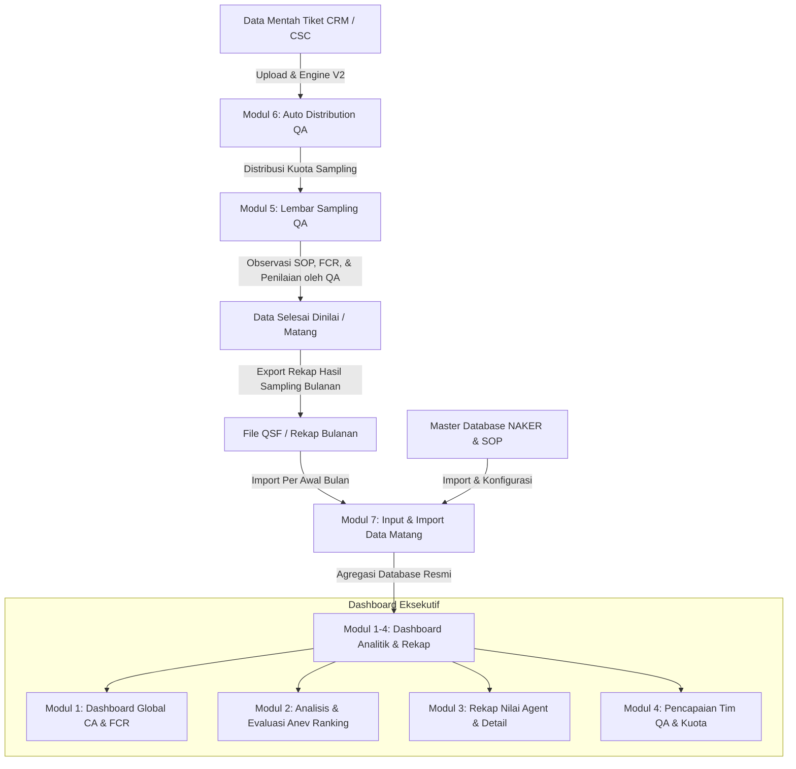

# DigiQA - Arsitektur Alur Data & Aturan Bisnis (Data Flow Rules)

Dokumen ini adalah acuan resmi sistem DigiQA mengenai pemisahan logika, alur data (*data pipeline*), dan navigasi operasional.

---

## 🧭 1. Pemisahan Logika Data: Data Mentah vs. Data Matang

---

## 📋 2. Rincian & Tanggung Jawab Modul Berdasarkan Urutan Navigasi

### 🔹 Modul 1 s/d 4: Dashboard & Analitik Eksekutif (Data Matang)
*Data yang ditampilkan adalah data resmi yang telah matang dan selesai diolah per periode bulanan.*
- **Modul 1: Dashboard Global** (`/dashboard-global`):
  - Menampilkan KPI makro: Skor Customer Accuracy (CA), First Contact Resolution (FCR), tren bulanan Jan–Des, dan distribusi performa per saluran.
- **Modul 2: Analisis & Evaluasi / Anev** (`/anev`):
  - Menampilkan peringkat performa agen (Top 5/10 dan Bottom 5/10), rekomendasi pembinaan mutu, dan insight deviasi parameter.
- **Modul 3: Rekap Nilai Agent** (`/rekap-agent`):
  - Menampilkan tabel rekapitulasi nilai per agen, rincian skor per parameter, filter TL/Trainer, serta export laporan PDF/Excel.
- **Modul 4: Pencapaian Tim QA** (`/pencapaian-qa`):
  - Menampilkan progres pencapaian kuota observasi bulanan tim QA, histori sampling, dan utilisasi evaluator.

---

### 🔹 Modul 5 & 6: Operasional Sampling & Data Mentah (Proses Penilaian)
*Proses pengambilan sampel dari data mentah hingga penilaian mutu interaksi agen.*
- **Modul 6: Auto Distribution QA** (`/auto-distribution`):
  - **Tujuan**: Menerima dan memproses **DATA MENTAH** (*raw ticketing transaction* dari CRM/CSC).
  - **Fungsi Engine**: Engine V2 membagi kuota data mentah secara proporsional dan anti-tabrakan (*collision-free*) ke 8 QA Evaluator.
  - **Karakter Data**: Data transaksi mentah yang belum memiliki nilai CA/FCR.
- **Modul 5: Lembar Sampling QA** (`/evaluasi-sampling`):
  - **Tujuan**: Tempat QA Evaluator melakukan penilaian langsung terhadap data mentah yang telah dialokasikan.
  - **Aktivitas QA**: Memeriksa rekaman/chat, mengisi matriks parameter SOP sesuai saluran (bobot poin), verifikasi FCR, dan memberikan catatan coaching.
  - **Aktivitas Supervisor**: Real-time monitoring antrean aktif dan audit disiplin pengerjaan harian/mingguan (deteksi tiket menggantung / *stalled*).
  - **Output**: Data bernilai yang berstatus `COMPLETED` (Data Matang).

---

### 🔹 Modul 7: Input, Import & Setting (Satu Pintu Data Matang & Master)
*Pintu masuk resmi untuk data yang sudah matang dan siap disajikan ke Dashboard 1-4.*
- **Modul 7: Input & Import Data Matang** (`/settings`):
  - **Tujuan**: Mengunggah **DATA YANG SUDAH DIOLAH / MATANG** (File QSF Final hasil penilaian sampling dari QA) setiap **awal bulan** (awal siklus pelaporan) agar teragregasi ke Dashboard 1–4.
  - **Database NAKER**: Tempat upload & sinkronisasi Master Data Tenaga Kerja (plotting agent, NIK, TL, Trainer, Site).
  - **Master SOP & Parameter**: Konfigurasi parameter penilaian CA dan formula mutu.

---

### 🔹 Modul 8: Kelola Akun Pengguna
- **Modul 8: Kelola Akun Pengguna** (`/kelola-akun`):
  - Manajemen akun pengguna, hak akses Role-Based Access Control (Supervisor, QA Evaluator, Trainer, Team Leader, Agent), dan sinkronisasi akun master NAKER.

---

## 🔒 3. Prinsip Pemisahan Logika (Core Rules)
1. **Tidak Mencampur Data Mentah ke Dashboard**: Data mentah pada Auto Distribution tidak boleh langsung ditampilkan di Dashboard 1–4 sebelum melewati proses penilaian di Lembar Sampling QA (Modul 5) dan di-import melalui Modul 7.
2. **Siklus Import Bulanan (Per Awal Bulan)**: Modul 7 digunakan per awal bulan untuk mengimpor file rekap QSF final yang sudah lengkap agar performa bulanan terkunci dan valid untuk evaluasi performa agen.
3. **Penyelarasan Naming & Navigasi**: Penamaan tombol, subtitle, dan instruksi pada antarmuka aplikasi harus selalu mencerminkan pemisahan antara data mentah (*raw sampling distribution*) dan data matang (*processed analytics data*).
