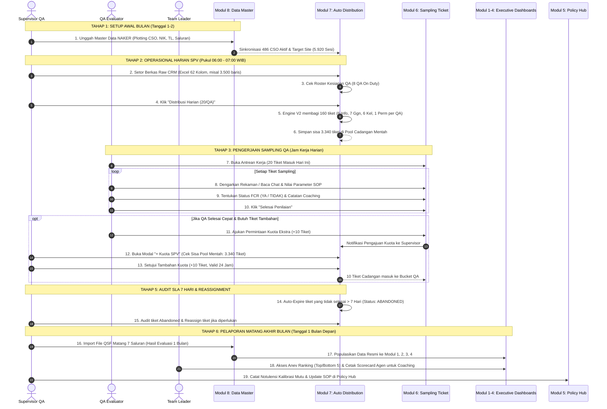

# 📘 BUKU PANDUAN OPERASIONAL & FLOW APLIKASI (MANUAL BOOK)
# DIGIQA ENTERPRISE (Q-APPS CONTACT CENTER MUTU v2.0)

> **Dokumen Resmi Standar Operasional Prosedur (SOP) & Panduan Pengisian Data End-to-End Sistem Manajemen Mutu Contact Center**

---

## 📑 DAFTAR ISI
1. [BAB I: Pendahuluan & Prinsip Arsitektur](#bab-i-pendahuluan--prinsip-arsitektur)
2. [BAB II: Matriks Peran Pengguna & Hak Akses (RBAC)](#bab-ii-matriks-peran-pengguna--hak-akses-rbac)
3. [BAB III: Diagram Alur Proses Bisnis End-to-End (FlowApps)](#bab-iii-diagram-alur-proses-bisnis-end-to-end-flowapps)
4. [BAB IV: Panduan Langkah Demi Langkah Pengisian & Pengelolaan Data](#bab-iv-panduan-langkah-demi-langkah-pengisian--pengelolaan-data)
   - [Langkah 1: Setup Awal Bulan — Master Data NAKER & Plotting (Modul 8)](#langkah-1-setup-awal-bulan--master-data-naker--plotting-modul-8)
   - [Langkah 2: Operasional Harian SPV — Unggah Tarikan CRM & Auto-Distribusi (Modul 7)](#langkah-2-operasional-harian-spv--unggah-tarikan-crm--auto-distribusi-modul-7)
   - [Langkah 3: Pelacakan Pool Cadangan Mentah & Penambahan Kuota SPV (Modul 7)](#langkah-3-pelacakan-pool-cadangan-mentah--penambahan-kuota-spv-modul-7)
   - [Langkah 4: Pengerjaan Sampling Mutu Harian oleh QA Evaluator (Modul 6)](#langkah-4-pengerjaan-sampling-mutu-harian-oleh-qa-evaluator-modul-6)
   - [Langkah 5: Monitoring Real-Time, Reassignment & Audit SLA 7 Hari (Modul 7)](#langkah-5-monitoring-real-time-reassignment--audit-sla-7-hari-modul-7)
   - [Langkah 6: Import Data Matang Bulanan (QSF 7 Saluran) untuk Dashboard Eksekutif (Modul 8)](#langkah-6-import-data-matang-bulanan-qsf-7-saluran-untuk-dashboard-eksekutif-modul-8)
   - [Langkah 7: Analisis Kinerja, Anev Ranking & Scorecard Pembinaan Agen (Modul 1–4)](#langkah-7-analisis-kinerja-anev-ranking--scorecard-pembinaan-agen-modul-14)
   - [Langkah 8: Sosialisasi SOP & Repositori Keputusan Kalibrasi (Modul 5)](#langkah-8-sosialisasi-sop--repositori-keputusan-kalibrasi-modul-5)
5. [BAB V: FAQ & Troubleshooting Operasional](#bab-v-faq--troubleshooting-operasional)

---

## BAB I: PENDAHULUAN & PRINSIP ARSITEKTUR

### 1.1 Latar Belakang
**DigiQA Enterprise (Q-Apps)** adalah platform tata kelola mutu Contact Center terpadu yang dirancang untuk mengotomatisasi proses sampling transaksi pelanggan, memfasilitasi penilaian kepatuhan SOP oleh tim Quality Assurance, memantau SLA pengerjaan tiket, serta menyajikan analitik performa agen secara *real-time*.

### 1.2 Prinsip Pemisahan Data (Core Architectural Rule)
DigiQA memisahkan secara tegas dua jalur pemrosesan data:
1. **Data Mentah Operasional Harian (Raw CRM Data)**:
   - Berasal dari tarikan harian transaksi pelanggan (Excel 62 kolom).
   - Diunggah oleh Supervisor setiap pagi (< 07:00 WIB) ke **Modul 7 (Ticketing / Auto Distribution)**.
   - Dibagi secara otomatis ke dalam antrean kerja QA (**20 tiket/hari per QA = 160 tiket/hari untuk 8 QA**).
   - Sisa ribuan tiket tersimpan dalam **Pool Cadangan Tiket Mentah** untuk kebutuhan penambahan kuota (`+ Kuota SPV`).
   - Dikerjakan dan dinilai oleh QA pada **Modul 6 (Sampling Ticket)**.
2. **Data Matang Dashboard Eksekutif (Processed QSF Data)**:
   - Berasal dari file rekapitulasi QSF 7 Saluran yang telah selesai dievaluasi penuh selama 1 bulan.
   - Diimpor di awal bulan melalui **Modul 8 (Data Master)**.
   - Mengkalkulasi metrik resmi pada **Modul 1 (Dashboard Global)**, **Modul 2 (QA Analytics & Anev)**, **Modul 3 (Agent Scorecards)**, dan **Modul 4 (Success Board)**.

---

## BAB II: MATRIKS PERAN PENGGUNA & HAK AKSES (RBAC)

| Modul | Nama Modul | Superadmin | Supervisor QA | QA Evaluator | Team Leader (TL) | CSO / Agent |
| :---: | :--- | :---: | :---: | :---: | :---: | :---: |
| **1** | **Dashboard Global** | ✅ Full | ✅ Full | 👁️ View | 👁️ View | 👁️ View (Own) |
| **2** | **QA Analytics (Anev)** | ✅ Full | ✅ Full | 👁️ View | 👁️ View | ❌ No |
| **3** | **Agent Scorecards** | ✅ Full | ✅ Full | 👁️ View | 👁️ View (Tim) | 👁️ View (Own) |
| **4** | **Success Board** | ✅ Full | ✅ Full | 👁️ View (Own) | ❌ No | ❌ No |
| **5** | **QA Policy Hub** | ✅ Full | ✅ Full | 👁️ View / Tanya | 👁️ View | 👁️ View |
| **6** | **Sampling Ticket** | ✅ Full | 👁️ Monitor / Audit | ✅ Nilai / Hold / Skip | 👁️ Monitor Tim | ❌ No |
| **7** | **Ticketing (Auto Dist)** | ✅ Full | ✅ Eksekusi & Kuota | 👁️ Bucket Sendiri | 👁️ Monitor Tim | ❌ No |
| **8** | **Data Master & Import** | ✅ Full | ✅ Import / Setting | ❌ No | ❌ No | ❌ No |
| **9** | **User Setting** | ✅ Full | 👁️ Terbatas | ❌ No | ❌ No | ❌ No |

---

## BAB III: DIAGRAM ALUR PROSES BISNIS END-TO-END (FLOWAPPS)



---

## BAB IV: PANDUAN LANGKAH DEMI LANGKAH PENGISIAN & PENGELOLAAN DATA

---

### LANGKAH 1: Setup Awal Bulan — Master Data NAKER & Plotting (Modul 8)
> **Waktu Pelaksanaan**: Setiap awal bulan baru (Tanggal 1–2).  
> **Pelaksana**: Supervisor QA / Admin.  
> **Tujuan**: Memastikan seluruh data agen CSO, NIK, saluran penugasan, dan Team Leader terdaftar secara akurat di sistem sebelum distribusi sampling dimulai.

1. Buka menu **Modul 8: Data Master** (`/data-master`).
2. Pilih tab **Import Master NAKER**.
3. Klik tombol **Download Template NAKER** untuk memastikan format file sesuai (Sheet `PLOTTING`).
4. Seret (*drag-and-drop*) atau pilih file Excel `DATA_NAKER_BULANAN.xlsx`.
5. Sistem akan menampilkan **Pratinjau Data (Preview)**:
   - Memeriksa jumlah baris data CSO aktif (misal: 486 CSO).
   - Memvalidasi saluran kerja (Inbound, Digilive, Socmed, Email, Outbound, Back Office).
6. Klik **Mulai Impor NAKER**.
7. Sistem mengonfirmasi: `✓ Berhasil mengimpor 486 data CSO! Target site otomatis terkalkulasi (5.920 Sesi).`

---

### LANGKAH 2: Operasional Harian SPV — Unggah Tarikan CRM & Auto-Distribusi (Modul 7)
> **Waktu Pelaksanaan**: Setiap hari kerja pada pagi hari (Target: Pukul 06:00 – 07:00 WIB).  
> **Pelaksana**: Supervisor QA.  
> **Tujuan**: Menyetor transaksi mentah pelanggan dari CRM dan membagi 160 tiket sampling harian ke 8 QA On Duty.

```text
┌─────────────────────────────────────────────────────────────────────────────┐
│ 1. Download file transaksi harian dari CRM/CSC (Format: Excel 62 Kolom)     │
│ 2. Buka Modul 7: Ticketing (Auto Distribution)                              │
│ 3. Klik tombol "Setor Berkas" pada Panel Manajemen Berkas CRM               │
│ 4. Pilih file Excel tarikan (misal: 3.500 transaksi mentah)                 │
│ 5. Klik Tab "Jadwal & Kesiapan QA" -> Pastikan 8 Evaluator berstatus ON DUTY│
│ 6. Klik tombol biru "Distribusi (20/QA)"                                    │
│ 7. Selesai: 160 Tiket terdistribusi, 3.340 Tiket tersimpan di Pool Cadangan │
└─────────────────────────────────────────────────────────────────────────────┘
```

#### Rincian Komposisi Distribusi Harian per QA:
Setiap QA Evaluator yang bertugas (*On Duty*) menerima tepat **20 tiket/hari** dengan komposisi:
- 🔵 **Informasi**: 6 Tiket
- 🔴 **Gangguan**: 7 Tiket
- 🟡 **Keluhan**: 6 Tiket
- 🟢 **Permohonan**: 1 Tiket
- **Total per QA**: 20 Tiket/Hari
- **Total Akumulasi Site (8 QA On Duty)**: **160 Tiket / Hari**

---

### LANGKAH 3: Pelacakan Pool Cadangan Mentah & Penambahan Kuota SPV (Modul 7)
> **Waktu Pelaksanaan**: Berjalan sepanjang jam kerja harian.  
> **Pelaksana**: Supervisor QA.  
> **Tujuan**: Memantau ketersediaan sisa tiket mentah di pool cadangan sebelum direset/dibuang, serta menyetujui penambahan kuota jika QA membutuhkan tiket ekstra.

1. Buka **Modul 7: Ticketing** (`/auto-distribution`).
2. Perhatikan banner **STATUS POOL TIKET MENTAH** di atas antrean kerja:
   - 📦 **Total Tarikan Mentah**: Menampilkan total transaksi CRM yang diunggah (misal: $3.500$ tiket).
   - 🎯 **Kebutuhan Harian**: Menampilkan target tim hari ini ($160$ tiket untuk 8 QA).
   - 📥 **Sudah Dialokasikan**: Tiket yang sudah masuk ke antrean kerja QA ($160$ tiket).
   - 🟢 **Sisa Cadangan Pool**: Sisa tiket mentah yang belum disampling ($3.340$ tiket).
3. **Mekanisme Penambahan Kuota (`+ Kuota SPV`)**:
   - Jika QA Evaluator menyelesaikan kuota 20 tiket lebih awal dan mengajukan tiket tambahan:
   - Supervisor mengklik tombol **`+ Kuota SPV`**.
   - Pada modal, pilih tab **Permintaan QA** (untuk menyetujui permohonan yang masuk) atau **Beri Kuota Manual** (pilih nama QA dan jumlah tiket: $+5, +10, +15, +20$).
   - Tiket tambahan diambil dari **Sisa Pool Cadangan** dan diberikan masa aktif khusus **24 Jam (1 Hari)**.

---

### LANGKAH 4: Pengerjaan Sampling Mutu Harian oleh QA Evaluator (Modul 6)
> **Waktu Pelaksanaan**: Jam kerja operasional harian.  
> **Pelaksana**: QA Evaluator.  
> **Tujuan**: Mengamati recording/transkrip interaksi agen dan menilai kepatuhan terhadap standar parameter SOP.

1. Login menggunakan akun QA Evaluator (`username: qa`).
2. Buka menu **Modul 6: Sampling Ticket** (`/lembar-sampling-qa`).
3. Pastikan status kehadiran Anda aktif (**ON DUTY**).
4. Klik tab **Antrean Tiket Saya**:
   - Tiket yang ditugaskan hari ini berlabel **Masuk Hari Ini** (*warna biru/indigo*).
   - Tiket sisa hari sebelumnya (jika ada) berlabel **⚠️ Tiket Menumpuk (Backlog)** (*warna amber*).
5. Klik tombol **Nilai Tiket** pada tiket yang ingin dikerjakan:
   - Putar rekaman audio atau baca riwayat percakapan chat.
   - Evaluasi setiap parameter mutu:
     1. *Greeting & Opening Standar*
     2. *Verifikasi Data Pelanggan*
     3. *Identifikasi Masalah & Kecepatan Respons*
     4. *Akurasi Informasi / Solusi Teknis*
     5. *Etika Komunikasi & Penggunaan Bahasa Baku*
     6. *Closing & Penawaran Bantuan Tambahan*
   - Pilih status **FCR (First Call Resolution)**: `YA` (Tuntas pada kontak pertama) atau `TIDAK` (Perlu eskalasi/tindak lanjut).
   - Masukkan **Catatan Pembinaan (Coaching Notes)** untuk agen CSO.
6. Klik **Simpan & Selesaikan Penilaian**.
7. Status tiket berubah menjadi **SUDAH DICEK (COMPLETED)** dan skor CA otomatis terkalkulasi.

#### Opsi Pengerjaan Lainnya:
- **Tunda (Hold / Pending)**: Digunakan jika rekaman memerlukan konfirmasi ke Team Leader.
- **Lewati (Skip)**: Digunakan jika rekaman kosong (*Silent Call / Blank Recording*). Wajib memilih alasan skip resmi.
- **Ajukan Tambah Kuota**: Jika 20 tiket harian telah selesai dinilai, klik tombol `+ Ajukan Kuota (+10 Tiket)` untuk meminta alokasi ekstra ke Supervisor.

---

### LANGKAH 5: Monitoring Real-Time, Reassignment & Audit SLA 7 Hari (Modul 7)
> **Waktu Pelaksanaan**: Pemantauan berkala harian & audit mingguan.  
> **Pelaksana**: Supervisor QA & Team Leader.

1. **Monitoring Kinerja Hari Ini**:
   - Pada Modul 7, pantau indikator **Selesai Hari Ini**, **On Cek / Dinilai**, dan **Tiket Menumpuk**.
2. **Reassignment Tiket**:
   - Jika seorang QA berhalangan hadir mendadak (*Sakit / Ijin*), Supervisor dapat mengklik ikon **Reassign (Tukar QA)** untuk mengalihkan tiketnya ke QA lain yang sedang bertugas.
3. **Audit Kedisiplinan SLA 7 Hari (Anti-Abandon)**:
   - Sistem menerapkan aturan ketat: **Seluruh tiket sampling wajib diselesaikan dalam waktu maksimal 7 hari (1 minggu)** sejak didistribusikan.
   - Tiket yang tidak selesai dalam 7 hari akan otomatis berubah status menjadi **ABANDONED**.
   - Buka tab **Audit & Tiket Abandoned (> 7 Hari)** untuk menginvestigasi tiket kedaluwarsa dan memberikan tegangan disiplin.

---

### LANGKAH 6: Import Data Matang Bulanan (QSF 7 Saluran) untuk Dashboard Eksekutif (Modul 8)
> **Waktu Pelaksanaan**: Setiap awal bulan baru (Tanggal 1–3) untuk periode bulan sebelumnya.  
> **Pelaksana**: Supervisor QA.  
> **Tujuan**: Memasukkan hasil evaluasi resmi bulanan untuk memicu kalkulasi di Dashboard Global, Anev Ranking, dan Rekap Nilai Agent.

1. Buka **Modul 8: Data Master** (`/data-master`).
2. Pilih tab **Import Data QSF**.
3. Pilih periode penilaian (misal: `September 2026`).
4. Unggah berkas Excel QSF matang per saluran:
   - `QSF_INBOUND_CALL.xlsx`
   - `QSF_DIGILIVE_CHAT.xlsx`
   - `QSF_SOCIAL_MEDIA.xlsx`
   - `QSF_EMAIL_INBOUND.xlsx`
   - `QSF_EMAIL_OUTBOUND.xlsx`
   - `QSF_OUTBOUND_CALL.xlsx`
   - `QSF_BACK_OFFICE.xlsx`
5. Sistem melakukan validasi baris header, NIK CSO, skor CA, dan status FCR.
6. Klik **Proses Impor QSF**.
7. Data resmi langsung tersinkronisasi ke seluruh Dashboard Eksekutif (Modul 1 s/d 4).

---

### LANGKAH 7: Analisis Kinerja, Anev Ranking & Scorecard Pembinaan Agen (Modul 1–4)
> **Waktu Pelaksanaan**: Pasca impor data QSF bulanan.  
> **Pelaksana**: Supervisor, Team Leader, Trainer QA.

1. **Modul 1: Dashboard Global (`/`)**:
   - Meninjau ketercapaian makro Site: Target Mutu **CA ≥ 85%** dan **FCR 100%**.
   - Menganalisis **5 Parameter Kegagalan Terendah** untuk menyusun materi penyegaran SOP.
2. **Modul 2: QA Analytics / Anev (`/qa-analytics`)**:
   - Melihat pemeringkatan **Top 5 High Performers** untuk pemberian apresiasi / reward.
   - Mengidentifikasi **Bottom 5 Agents** untuk penjadwalan sesi *coaching* intensif dan kalibrasi mutu.
3. **Modul 3: Agent Scorecards (`/agent-scorecards`)**:
   - Team Leader mencari nama/NIK agen binaannya.
   - Mengunduh lembar observasi lengkap dalam format **PDF** atau **Excel** untuk sesi pembinaan tatap muka (*1-on-1 Coaching Session*).
4. **Modul 4: Success Board (`/success-board`)**:
   - Mengevaluasi pencapaian target bulanan 8 QA Evaluator (Target: 370 sesi/bulan).

---

### LANGKAH 8: Sosialisasi SOP & Repositori Keputusan Kalibrasi (Modul 5)
> **Waktu Pelaksanaan**: Berkala saat ada perubahan kebijakan / pasca rapat kalibrasi mutu.  
> **Pelaksana**: Seluruh Tim QA & Supervisor.

1. Buka **Modul 5: QA Policy Hub** (`/qa-policy-hub`).
2. Klik tombol **+ Tambah Kebijakan / Notulensi Baru**.
3. Pilih kategori (*Operational*, *Billing*, *Technical*, *General*), masukkan judul, nomor surat keputusan, tanggal berlaku, dan rincian pedoman SOP.
4. Simpan dokumen. Seluruh personel Contact Center dapat mencari dan membaca pedoman resmi tersebut kapan saja.

---

## BAB V: FAQ & TROUBLESHOOTING OPERASIONAL

#### Q1: Berapa target kuota sampling harian dan bulanan yang berlaku?
> **Jawaban**: 
> - **Target Harian per QA**: 20 Tiket/Hari (6 Info, 7 Ggn, 6 Kel, 1 Perm).
> - **Target Harian Tim Site (8 QA On Duty)**: 160 Tiket/Hari.
> - **Target Bulanan per QA**: 370 Sesi/Bulan (346 Mandatory + 24 Buffer).
> - **Target Bulanan Site (8 QA Utama)**: 2.960 Sesi/Bulan.

#### Q2: Apa yang terjadi jika file tarikan CRM harian berisi ribuan tiket mentah?
> **Jawaban**: 
> Sistem secara cerdas hanya mendistribusikan **160 tiket** ke 8 QA On Duty. Sisa ribuan tiket tidak hilang, melainkan disimpan di **Pool Cadangan Tiket Mentah**. Sisa tiket ini siap digunakan kapan saja jika Supervisor ingin memberikan kuota tambahan (`+ Kuota SPV`).

#### Q3: Berapa lama masa aktif tiket tambahan yang diberikan melalui `+ Kuota SPV`?
> **Jawaban**: 
> Tiket tambahan memiliki masa aktif khusus **24 Jam (1 Hari)**. Jika tidak diselesaikan dalam 24 jam, tiket tambahan akan kedaluwarsa secara otomatis untuk mencegah penumpukan antrean kerja.

#### Q4: Apa konsekuensi jika QA Evaluator tidak menyelesaikan tiket dalam 7 hari?
> **Jawaban**: 
> Sesuai SLA Kedisiplinan 7 Hari (*Rule 1 Minggu*), tiket akan otomatis berubah status menjadi **ABANDONED**. Tiket masuk ke radar investigasi Supervisor pada tab *Audit & Tiket Abandoned* dan mengurangi metrik kepatuhan SLA QA yang bersangkutan.

#### Q5: Apakah data sampling harian di Modul 6 & 7 mempengaruhi grafik di Modul 1 (Dashboard Global)?
> **Jawaban**: 
> **Tidak**. Sesuai prinsip *Separation of Data*, Modul 1–4 bersumber murni dari data matang bulanan QSF yang diimpor pada Modul 8. Pengerjaan sampling harian di Modul 6 adalah proses operasional mutu berjalan.

---

*Dokumen ini diterbitkan secara resmi oleh Tim Tata Kelola Mutu & IT Contact Center DigiQA Enterprise.*  
*Hak Cipta © 2026 DigiQA System. Seluruh hak cipta dilindungi undang-undang.*
